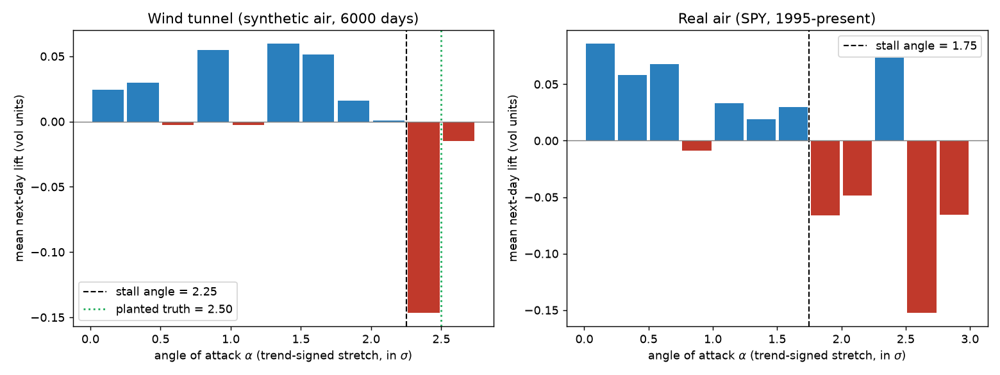
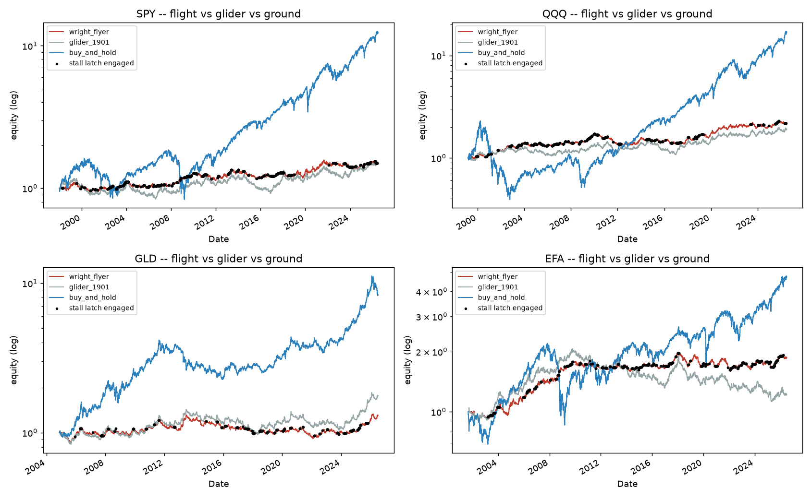
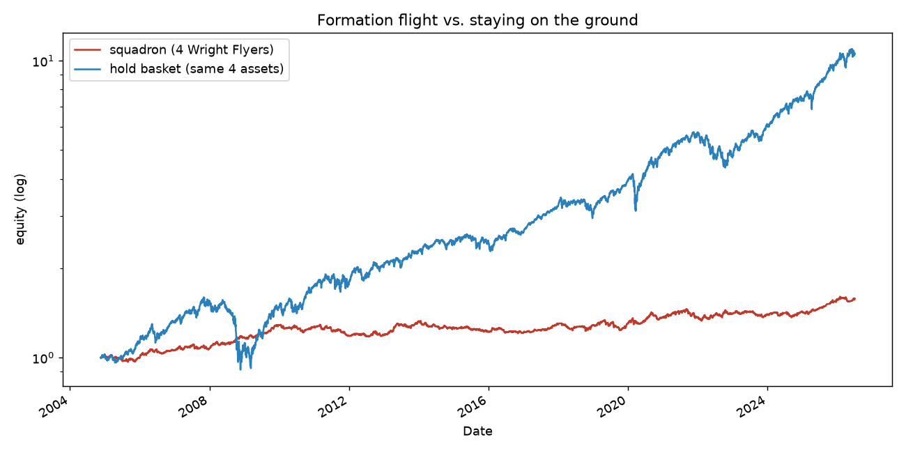

# The Wright Flyer

*A trading strategy invented the way the Wrights invented flight.*

In 1899 everyone trying to fly was asking the same question — *how do we get
more lift?* — and dying of a different one. Lilienthal, the greatest glider
pilot alive, was killed by a stall. The Wrights' heresy was to decide that
flight was not a lift problem but a **measurement-and-control** problem: they
refused the published lift tables, built their own wind tunnel, measured
where the airflow actually separates, and put three-axis control between the
pilot and the weather.

This project reruns that program with a market instead of an atmosphere. The
result is a strategy whose every part is an aircraft part, and whose one
load-bearing parameter — the stall angle — is never assumed, only measured.

## The aerodynamic dictionary

| Aircraft | Market | Definition |
|---|---|---|
| glide path | trend line | EMA of log price (span 50) |
| angle of attack α | over-extension | (log price − glide path) / stationary deviation scale, signed along the trend |
| airspeed v | trend signal-to-noise | \|glide-path slope\| / volatility |
| dynamic pressure q | trend conviction | tanh((v / v_scale)²) ∈ [0, 1) |
| air density ρ | inverse turbulence | vol target / realized vol, capped |
| lift curve C_L(α) | payoff of extension | E[next-day trend-signed return \| α], measured, not assumed |
| **stall angle** | **where extension stops paying** | the α beyond which C_L turns negative — measured from data |

The position is the lift equation, deliberately shaped like L = ½ρv²SC_L:

```
weight = direction · ρ · q(v) · C_L(α)
```

A trend-follower with vol targeting is the "wing". What makes it a Wright
machine is everything wrapped around the wing:

1. **The wind tunnel** (`flyer/wind_tunnel.py`). A synthetic airmass with a
   *planted, mechanical stall angle*: blow-off segments melt up with
   accelerating drift and crack **when — and only when — the price's
   standardized extension crosses the planted threshold**. Separation is
   caused by extension, not by the calendar, so the tunnel has a true stall
   angle against which the estimator can be scored.

2. **The stall-angle balance** (`flyer/aerodynamics.py`). Bin observed
   (α, next-day lift) pairs and pick the bin edge that maximizes the
   *cumulative lift accumulated below it*. While the flow is attached each
   bin adds lift and the running sum rises; past separation each bin
   subtracts, so the sum peaks at the true separation angle. Recalibrated
   monthly on a trailing 4-year window, strictly from data available at
   decision time.

3. **Three-axis control + stall latch** (`flyer/controls.py`).
   *Pitch*: exposure tapers linearly from 60% of the stall angle and reaches
   zero at stall. *Roll*: position changes are rate-limited (0.15/day).
   *Yaw*: an adverse-yaw dead-band ignores target changes smaller than 0.03 —
   chasing them is turnover drag with no lift. *The latch*: past the stall
   angle the craft dumps exposure at emergency authority (0.5/day) and — the
   part that keeps pilots alive — **does not rebuild until α has come back
   inside half the stall angle** (hysteresis), because pulling the nose up
   the moment the buffeting stops is how you stall twice.

## The invention, step by step

### Experiment 1 — the gliders that disappointed (1900–1901)

`experiments/01_kites_and_gliders.py` flies two naive craft through the
tunnel: pure trend-following built from "published tables" (no angle-of-attack
instrument), and the same craft with double the wing. P&L attribution by
regime shows both make lift in trends and melt-ups and hand a large piece
back in the cracks; more wing doubles the crash (crack P&L −0.39 vs −0.77
log-return units; drawdown −24% vs −44%). **The problem is not lift. It is
not knowing the stall angle.**

### Experiment 2 — the wind tunnel (autumn 1901)

`experiments/02_wind_tunnel.py` puts the instrument on the balance. With the
tunnel's stall planted at α = 2.5, the estimator measures 2.41 ± 0.61 across
20 independent 6000-day airmasses — unbiased, honestly noisy. Then the same
balance is pointed at real air: **SPY's measured lift curve has the same
separated-flow shape, with the stall at α ≈ 1.75.** The real atmosphere
stalls earlier than the synthetic one. This is the Lilienthal correction:
had we flown the assumed angle, we'd have flown 40% past the real stall.



### Experiment 3 — first flight (December 17, 1903)

`experiments/03_first_flight.py` flies the full craft through SPY, QQQ, GLD
and EFA (1998–present where available), 5 bps costs, next-day execution,
against the 1901 glider and against staying on the ground (buy & hold).



Four flights, then formation (equal-weight across the four flyers,
2004–2026):

| | ann. return | ann. vol | Sharpe | max drawdown |
|---|---|---|---|---|
| Squadron (4 Wright Flyers) | 2.1% | 4.9% | 0.46 | **−9.2%** |
| Hold basket (same 4 assets) | 11.5% | 15.8% | 0.77 | −43.0% |



**Read the numbers the way the Wrights read December 17.** The first flight
was 120 feet; the Flyer did not outrun the train to Kitty Hawk. Over a sample
dominated by one of the great bull markets in history, buy-and-hold out-lifts
everything — it should. What the craft demonstrates is *controlled* flight:
one third of the volatility, a worst drawdown of −9% against −43% (−83% on
QQQ alone), the stall latch engaged about 20% of flight time, and on the
craft's worst asset the latch is what keeps the glider's −46% EFA drawdown at
−19%. Control is the thing that was invented; lift compounds only after the
craft stops crashing.

## Pre-flight inspection

`tests/test_flyer.py` — 24 checks, ordered by how fast their failure kills:

- **No lookahead**: rewriting the last 250 days of prices leaves every prior
  weight bit-for-bit identical; a prefix run reproduces the full run.
- **Stall latch**: engages past stall, holds through the hysteresis band,
  releases only after recovery, always reaches zero.
- **Control limits**: roll rate, structural leverage cap, yaw dead-band.
- **Flight recorder**: lag-1 execution and turnover costs are exact.
- **The balance**: recovers a planted stall angle; healthy air yields no
  false stall; the tunnel's planted 2.5 is recovered without bias.

## Flying it yourself

```bash
pip install -r requirements.txt
python -m pytest tests/ -q
python experiments/01_kites_and_gliders.py   # why naive craft crash
python experiments/02_wind_tunnel.py         # measure the stall angle
python experiments/03_first_flight.py        # real air (downloads data)
```

Everything the experiments print and plot lands in `report/`. Real prices
come from yfinance and are cached in `data_cache/` (gitignored).

## What is honestly claimed, and what is not

Claimed: a novel *construction* — a trend machine whose over-extension
cutoff is a measured, periodically recalibrated quantity with a ground-truth
test harness (the planted-stall tunnel), wrapped in control laws with
hysteresis that are tested like flight hardware. Causality is enforced by
test, costs are charged, and no parameter was tuned on the reported real-data
results.

Not claimed: that this beats buy-and-hold on return, that 28 years of four
ETFs proves anything about the future, or that 5 bps covers real execution
for a large book. This is a research aircraft, not an airline. Nothing here
is investment advice.
